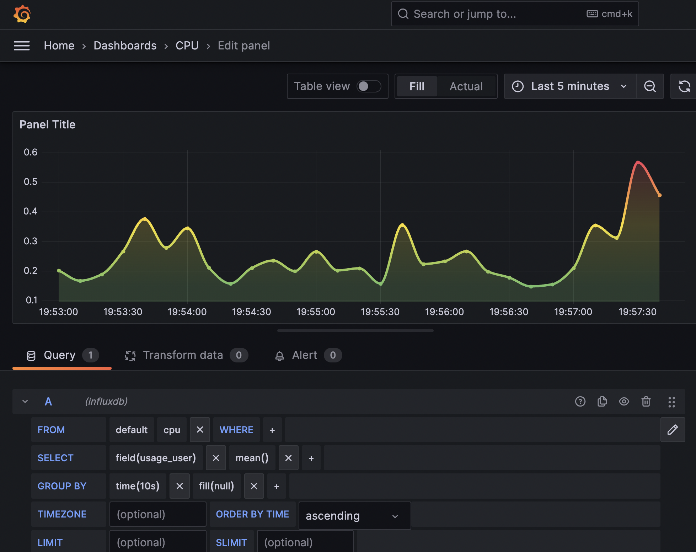
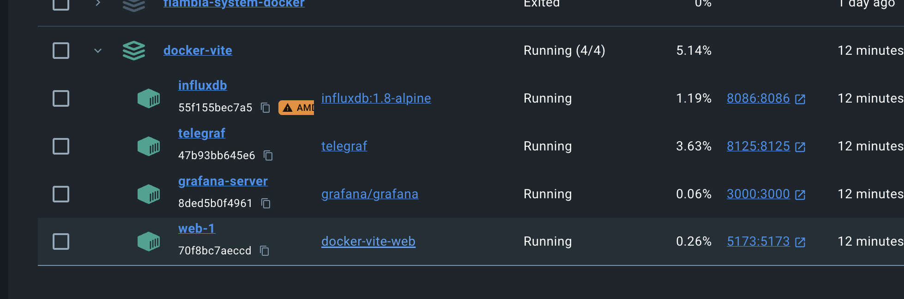

# React ⚛ + TypeScript 📝 + Vite ✌️ + Grafana 📊 + Telegraf ☎️ + InfluxDB 💽

```
npm install
```

```
sudo docker compose up
```

## Grafana

```
Login to Grafana (admin, admin)
```

### Create data source

- url: `http://influxdb:8086`

---

- database: `influx`
- user: `admin`
- password: `admin`

### Create a dashboard



## Vite React app


## Docker 🐳


